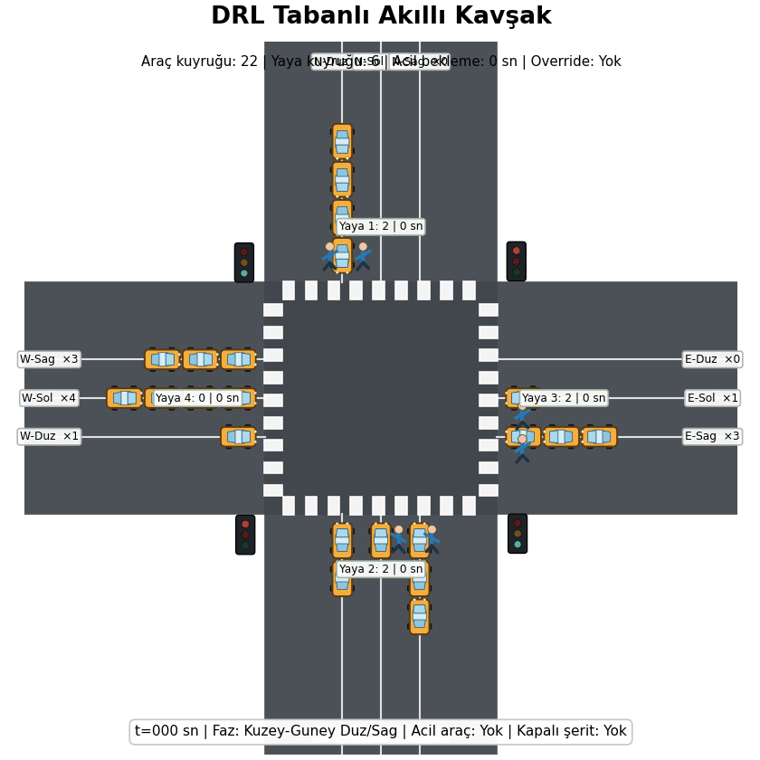
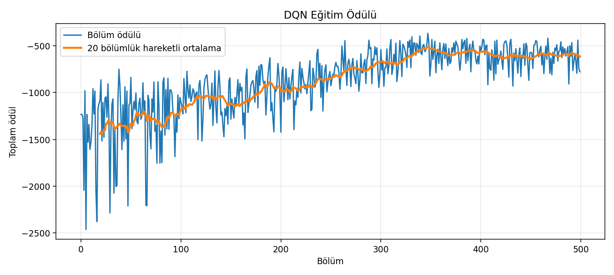

# Derin Pekiştirmeli Öğrenme Tabanlı Akıllı Kavşak Kontrol Sistemi

Bu proje, dört kollu bir kavşakta trafik ışıklarını **Derin Pekiştirmeli Öğrenme (DRL)** ile dinamik olarak kontrol eden bir simülasyon çalışmasıdır. Sistem, araç kuyruklarını azaltmayı hedeflerken yaya bekleme süresini, acil araç önceliğini ve geçici şerit kapanmalarını da dikkate alır.

> **Not:** README içinde GIF’in çalışması için `README.md` dosyası ile `assets/traffic_control_demo_slow.gif` dosyası aynı depo yapısında ve aynı büyük-küçük harf kullanımıyla bulunmalıdır.

## Proje Animasyonu

<p align="center">
  
</p>

## Eğitim Ödülü Grafiği

<p align="center">
  
</p>

## Proje Özellikleri

- Dört kollu kavşak yapısı
- Her yönde düz, sol dönüş ve sağ dönüş şeritleri
- Dört farklı yaya geçidi
- Yaya yoğunluğu ve ortalama yaya bekleme süresine göre yaya fazı
- Ambulans / itfaiye tespiti ve acil araç önceliği
- Dinamik yeşil ışık süresi seçimi: **8, 12 veya 16 saniye**
- Faz değişimlerinde sarı ışık güvenlik süresi
- Geçici şerit kapanması senaryosu
- Yoğun saat trafik talebi
- Double DQN yaklaşımı
- Replay Buffer, Target Network ve epsilon-greedy keşif stratejisi
- Eğitim ödülü grafiği ve GIF tabanlı görsel simülasyon

## Kullanılan Yöntem

Model, trafik ışığı kontrolünü bir Markov Karar Süreci olarak ele alır.

### Ajan

Trafik ışığı kontrol sistemi.

### Ortam

12 araç şeridi, 4 yaya geçidi, değişen trafik yoğunluğu, acil araç olayı ve şerit kapanması bulunan dört kollu kavşak.

### Durum Uzayı

Ajan aşağıdaki bilgileri gözlemler:

- Şerit bazlı araç kuyrukları
- Şerit bazlı ortalama araç bekleme süreleri
- Yaya geçitlerindeki kişi sayıları
- Ortalama yaya bekleme süreleri
- Mevcut trafik ışığı fazı
- Mevcut fazın süresi
- Kapalı şerit bilgisi
- Acil aracın bulunduğu şerit
- Acil araç bekleme süresi
- Normal / yoğun / düşük trafik profili

### Aksiyon Uzayı

Ajan, 5 ışık fazı ve 3 yeşil süre seçeneği arasından seçim yapar:

| Faz | Açıklama |
|---|---|
| 0 | Kuzey-Güney düz ve sağ dönüş |
| 1 | Doğu-Batı düz ve sağ dönüş |
| 2 | Kuzey-Güney sol dönüş |
| 3 | Doğu-Batı sol dönüş |
| 4 | Yaya geçiş fazı |

Her faz için 8, 12 veya 16 saniye yeşil ışık süresi seçilir. Toplam aksiyon sayısı **15**’tir.

### Ödül Fonksiyonu

Ödül fonksiyonu; araç/yaya kuyruklarını ve bekleme maliyetini azaltırken kavşaktan geçen araç ve yaya sayısını artıracak şekilde tasarlanmıştır. Acil aracın beklemesi ve kapalı şeritte kuyruk oluşması ek ceza üretir.

## Güvenlik Katmanı

Ajanın kararına ek olarak iki zorunlu güvenlik kontrolü kullanılır:

- Acil araç bekleme süresi belirli eşiği aşarsa, ilgili şeride yeşil ışık veren faz seçilir.
- Bir yayanın bekleme süresi üst sınırı aşarsa, yaya fazı zorunlu olarak aktif edilir.

Bu yapı, modelin verimliliğini korurken güvenlik ve adalet gereksinimlerini de gözetir.

## Kurulum

```bash
git clone <repository-url>
cd DRL_Traffic_Signal_Control_TR
pip install -r requirements.txt
```

## Çalıştırma

```bash
python DRL_FinalProject.py
```

Google Colab üzerinde çalıştırmak için dosyaları yükledikten sonra:

```python
!pip install -r requirements.txt
!python DRL_FinalProject.py
```

## Oluşturulan Çıktılar

Program tamamlandığında `outputs_drl_traffic` klasörü altında aşağıdaki dosyalar oluşturulur:

```text
outputs_drl_traffic/
├── traffic_dqn_model.pt
├── traffic_control_demo_slow.gif
└── training_curve.png
```

| Dosya | Açıklama |
|---|---|
| `traffic_dqn_model.pt` | Eğitilmiş Double DQN model ağırlıkları |
| `traffic_control_demo_slow.gif` | Trafik ışığı kararlarını gösteren animasyon |
| `training_curve.png` | Bölüm ödülleri ve 20 bölümlük hareketli ortalama |

## Proje Yapısı

```text
DRL_Traffic_Signal_Control_TR/
├── DRL_FinalProject.py
├── README.md
├── requirements.txt
├── .gitignore
└── assets/
    ├── traffic_control_demo_slow.gif
    └── training_curve.png
```

## Temel Hiperparametreler

| Parametre | Değer |
|---|---:|
| Eğitim bölümü | 500 |
| Maksimum simülasyon süresi | 360 saniye |
| Öğrenme oranı | 0.001 |
| Replay Buffer kapasitesi | 50.000 |
| Batch size | 128 |
| İndirim katsayısı | 0.995 |
| Başlangıç epsilon değeri | 1.0 |
| Minimum epsilon değeri | 0.05 |
| Yeşil ışık süreleri | 8 / 12 / 16 saniye |

## Geliştirme Fikirleri

- Sabit zamanlı trafik ışığı ile nicel performans karşılaştırması
- Birden fazla kavşağı kapsayan çok ajanlı pekiştirmeli öğrenme
- Gerçek trafik verisi veya SUMO entegrasyonu
- Otobüs, tramvay ve bisikletli önceliği
- Hava koşulu, kaza ve yol çalışması senaryoları
- PPO veya Dueling DQN gibi farklı DRL algoritmalarının karşılaştırılması
